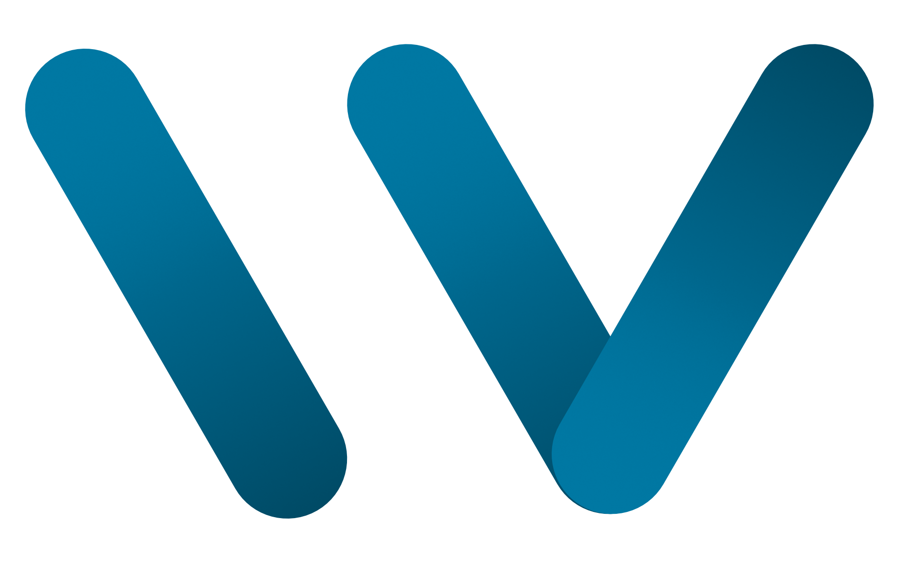
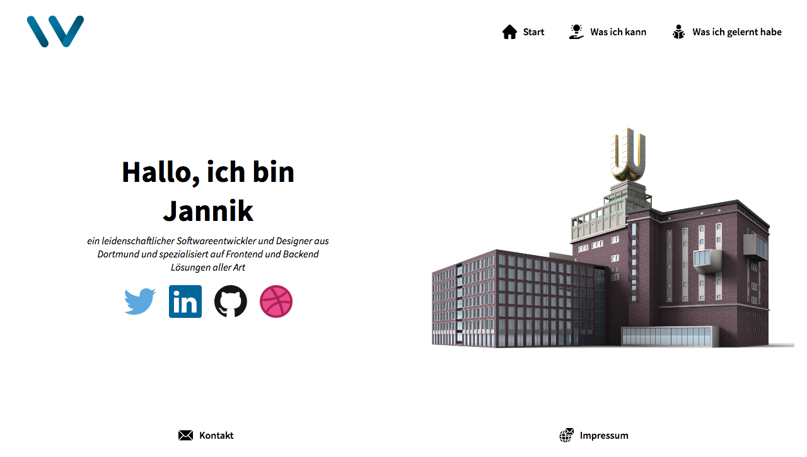

<!-- PROJECT LOGO -->
 

  

  <h3 align="center">Portfolio</h3>

  

    My new Portfolio Webpage
     
     
    <a href="https://willey3x37.de" target="_blank">View</a>
    ·
    <a href="https://vercel.com/dashboard" target="_blank">Hosting</a>
    ·
    <a href="https://strapi-portfolio-cms.herokuapp.com/admin" target="_blank">Admin</a>
    ·
    <a href="https://account.mongodb.com/account/login?n=%2Fv2%2F5fd1ef778e65fd6f68517c17&nextHash=%23clusters" target="_blank">Database</a>
  

<!-- TABLE OF CONTENTS -->

  
Table of Contents

  <ol>
    <li>
      <a href="#about-the-project">About The Project</a>
      <ul>
        <li><a href="#built-with">Built With</a></li>
      </ul>
    </li>
  </ol>

<!-- ABOUT THE PROJECT -->

## About The Project

### Built with

- [Strapi](https://strapi.io)
- [Next.js](https://nextjs.org/)
- [mongoDB](https://www.mongodb.com)

### Screenshots

